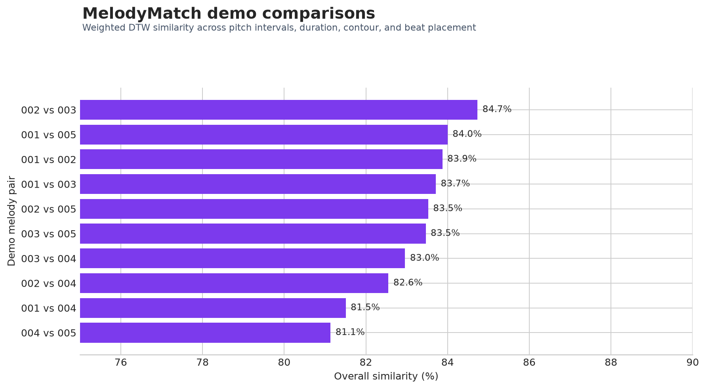

# MelodyMatch

**Explainable MIDI melody comparison with dynamic time warping.**

[](https://github.com/SelormEssey/MelodyMatch/actions/workflows/tests.yml)
[](https://www.python.org/)
[](https://streamlit.io/)

MelodyMatch is an interactive music-information-retrieval project that compares
symbolic melodies and explains what makes them similar. It extracts the lead
melody from MIDI, aligns musical sequences of different lengths, and presents
an overall score with interpretable pitch, rhythm, contour, and beat evidence.

## Why this project

A single similarity number is difficult to trust. MelodyMatch keeps the result
connected to musical structure so a listener, musician, or researcher can see
which characteristics agree and which differ.

The interface supports two workflows:

- explore five bundled POP909 demonstrations immediately
- upload any two `.mid` or `.midi` files for a custom comparison

## Demo results



Across the ten bundled comparisons, overall scores range from **81.1% to
84.7%**. The strongest pair is `002` and `003`, driven partly by a **90.3%
pitch-interval match**. These values describe similarity under this project's
weighted feature definition. They are not classification accuracy or human
similarity ratings.

| Example pair | Overall | Pitch intervals | Duration | Contour | Beat placement |
|---|---:|---:|---:|---:|---:|
| `002` vs `003` | **84.7%** | 90.3% | 84.1% | 75.3% | 83.5% |
| `001` vs `002` | **83.9%** | 85.2% | 81.3% | 83.8% | 86.3% |
| `004` vs `005` | **81.1%** | 83.9% | 81.2% | 77.6% | 76.8% |

The full reproducible output is available in
[`docs/demo_results.csv`](docs/demo_results.csv).

## How it works

1. Parse the MIDI and select a track labeled `MELODY`.
2. When that label is absent, disclose and apply a documented non-drum-track
   fallback.
3. Extract pitch intervals, relative note durations, melodic contour, and beat
   phase.
4. Align each sequence with dynamic time warping.
5. Convert distances into component similarities and calculate a transparent
   weighted score.

| Component | Weight | What it captures |
|---|---:|---|
| Pitch intervals | 40% | Movement between consecutive notes |
| Note duration | 30% | Relative rhythmic lengths |
| Melodic contour | 20% | Upward, downward, or repeated motion |
| Beat placement | 10% | Position within the beat cycle |

Uploaded MIDI files usually lack POP909 beat annotations. In that case,
MelodyMatch clearly marks beat placement as unavailable and reweights the score
across the other three components.

## Run locally

```bash
git clone https://github.com/SelormEssey/MelodyMatch.git
cd MelodyMatch
python -m venv .venv
source .venv/bin/activate
pip install -r requirements.txt
streamlit run app.py
```

Run the command-line analysis and export every demonstration pair:

```bash
python run_backend.py
```

## Testing

The test suite covers feature extraction, beat phase, DTW scoring, missing-beat
handling, MIDI parsing, the five-song pipeline, and both Streamlit interface
modes.

```bash
pip install -r requirements-dev.txt
pytest -q
```

GitHub Actions runs the same suite on every pull request and push to `main`.

## Reproduce the results figure

```bash
python -m scripts.generate_demo_assets
```

This regenerates the results CSV and chart directly from the bundled MIDI
examples.

## Project structure

```text
MelodyMatch/
├── app.py                       # Interactive comparison studio
├── run_backend.py               # Command-line analysis
├── melodymatch/                 # Feature extraction and similarity engine
├── tests/                       # Automated unit and integration tests
├── scripts/generate_demo_assets.py
├── docs/                        # Reproducible results and visuals
├── data/POP909/                 # Five licensed demonstration melodies
└── .github/workflows/tests.yml  # Continuous integration
```

## Limitations

- Similarity weights are human-readable design choices, not learned from
  listener judgments.
- The fallback melody-track heuristic may choose the wrong voice in dense,
  unlabeled arrangements.
- MIDI captures symbolic notes, not timbre, production, lyrics, or audio
  performance.
- The bundled set is intentionally small and demonstrates behavior rather than
  population-level evaluation.

## Data attribution

The bundled files are excerpts from the
[POP909 dataset](https://github.com/music-x-lab/POP909-Dataset), distributed
under its MIT License. See [`data/POP909/NOTICE.md`](data/POP909/NOTICE.md) for
the source and academic citation.

## Author

**Selorm Essey**

M.S. Computer Science, Emory University

[GitHub](https://github.com/SelormEssey) · [LinkedIn](https://www.linkedin.com/in/selormessey/)
